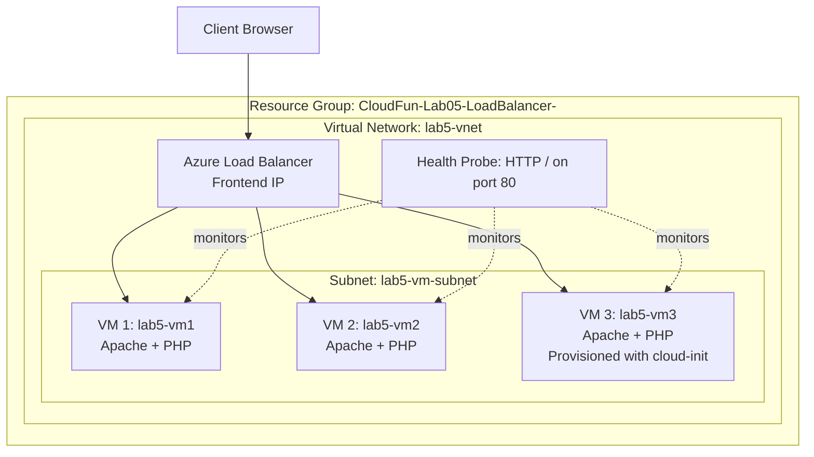

# Lab 5 - Load Balancer

In this lab, you will build a simple load-balanced web application using Azure Virtual Machines and an Azure Load Balancer.

## Architecture overview

The following diagram shows the target architecture used in this lab.



The health probe is a continuous check that the load balancer runs against each VM (HTTP request to `/` on port `80`). If a VM stops responding or returns failures, Azure marks it unhealthy and temporarily removes it from the backend rotation. This prevents users from being sent to broken instances and improves the application's availability.

## Learning Objectives

By the end of this lab, you should be able to:

- Provision multiple VMs in Azure
- Configure a basic web server
- Deploy a simple web application
- Configure an Azure Load Balancer
- Verify load balancing is working

## Lab Scenario

You are designing a simple web application that must remain available even if one server fails. To achieve this, you will distribute traffic across multiple servers using a load balancer.

---

## Exercise 1 - Create a Virtual Network and Subnet

1. In the Azure portal, navigate to "Virtual networks" and click "Create" > "Virtual network".
2. Fill in the basic details:
    - Subscription: `Cloud Fundamentals Labs`
    - Resource group: `CloudFun-Lab05-LoadBalancer-<your studentid number>`
    - Name: `lab5-vnet`
    - Region: Choose a nearby region (deploy all resources in the same region)
3. Under "IP Addresses", click "Add subnet" and fill in the details:
    - Subnet name: `lab5-subnet`
    - Subnet address range: `10.0.1.0/24`
4. Click "Add" to create the subnet, then click "Review + create" and "Create" to deploy the virtual network.

Alternatively, you can use the Azure CLI to create the virtual network and subnet (use the Azure cloud shell):

```bash
az network vnet create \
  --resource-group CloudFun-Lab05-LoadBalancer-<your studentid number> \
  --name lab5-vnet \
  --location "<your region>" \
  --address-prefix 10.0.0.0/16 \
  --subnet-name lab5-vm-subnet \
  --subnet-prefix 10.0.1.0/24
```

## Exercise 2 - Provisioning Virtual Machines

### 1. Create the VMs
Create two virtual machines that will host the web application. Follow the steps below to create the first VM, and repeat the process to create a second VM (e.g., `lab5-vm2`).

1. In the Azure portal, navigate to "Virtual machines" and click "Create" > "Virtual machine".
2. Fill in the basic details:
    - Subscription: `Cloud Fundamentals Labs`
    - Resource group: `CloudFun-Lab05-LoadBalancer-<your studentid number>`
    - Virtual machine name: `lab5-vm1`
    - Region: Choose a nearby region (deploy all VMs in the same region)
    - Image: Ubuntu Server 24.04 LTS
    - Size: Select a size (e.g., **Standard_B1s** for testing)
    - Authentication type: **SSH public key**
    - Username: `azureuser`
    - SSH public key: **Generate a new key pair**
    - Inbound ports: allow:
        - SSH (22)
        - HTTP (80)
3. Under "Networking", ensure the VM is connected to the virtual network and subnet you created earlier (`lab5-vnet` and `lab5-vm-subnet`).
3. Click "Review + create" and then "Create" to deploy the VM.
4. Download the SSH private key when prompted, and save it securely for later use.
5. Repeat the above steps to create a second VM named `lab5-vm2` with the same configuration.

Alternatively, you can use the Azure CLI to create the VMs (use the Azure cloud shell):

```bash
az vm create \
  --resource-group CloudFun-Lab05-LoadBalancer-<your studentid number> \
  --location "<your region>" \
  --name lab5-vm1 \
  --image Ubuntu2404 \
  --size Standard_B1s \
  --admin-username azureuser \
  --generate-ssh-keys \
  --vnet-name lab5-vnet \
  --subnet lab5-vm-subnet
```

For the second VM, change the name to `lab5-vm2` in the above command. If you are using Azure Cloud shell, use the same ssh key from the first VM:

```bash
az vm create \
  --resource-group CloudFun-Lab05-LoadBalancer-<your studentid number> \
  --location "<your region>" \
  --name lab5-vm2 \
  --image Ubuntu2404 \
  --size Standard_B1s \
  --admin-username azureuser \
  --ssh-key-value ~/.ssh/id_rsa.pub \
  --vnet-name lab5-vnet \
  --subnet lab5-vm-subnet
```

And open the necessary ports:

```bash
az vm open-port --resource-group CloudFun-Lab05-LoadBalancer-<your studentid number> --name lab5-vm1 --port 22
az vm open-port --resource-group CloudFun-Lab05-LoadBalancer-<your studentid number> --name lab5-vm1 --port 80
```

### 2. Connect to the VM

1. Once each VM is deployed, go to the "Overview" page of `lab5-vm1`.
2. Note the public IP address assigned to the VM.
3. Open a terminal and connect to the VM using SSH:
   ```bash
   ssh -i /path/to/your/private/key azureuser@<public-ip-address>
   ```
   (If you are using Azure Cloud Shell, you can omit the `-i` option since the SSH keys are already available in the cloud shell environment.)
4. Repeat the above steps to connect to `lab5-vm2`. (Use a separate terminal window for each VM.)

### 3. Install Apache and PHP

On each VM, you will install the Apache web server and PHP to serve a simple web application.

Run the following on each VM:

```bash
sudo apt update
sudo apt install -y apache2 php libapache2-mod-php
```

### 4. Validate Apache is working

1. Ensure the service is active:

```bash
sudo systemctl status apache2
```

2. In a browser, open `http://<vm1-public-ip>`.
3. Confirm the default Apache page loads before continuing.
4. Repeat the above steps for `lab5-vm2` to confirm Apache is working on both VMs.

### 5. Create a simple PHP application

1. On each VM, create a new PHP file in the web root directory:

```bash
echo "<?php echo 'Hello from ' . gethostname(); ?>" | sudo tee /var/www/html/index.php
```
2. In a browser, open `http://<vm1-public-ip>` and `http://<vm2-public-ip>`.
3. You should see a message indicating which VM is serving the request (e.g., "Hello from lab5-vm1" or "Hello from lab5-vm2").

---

## Exercise 2 - Configuring the Load Balancer

### 1. Create a Load Balancer

1. In the Azure portal, navigate to "Load balancers" and click "Create" > "Load balancer". (If you don't see "Load balancers" in the left-hand menu, use the search bar to find it.)
2. Fill in the basic details:
    - Subscription: `Cloud Fundamentals Labs`
    - Resource group: `CloudFun-Lab05-LoadBalancer-<your studentid number>`
    - Name: `lab5-loadbalancer`
    - Region: Same region as your VMs
    - SKU: **Standard**
    - Type: **Public**
    - Tier: **Regional**
3. Under "Frontend IP configuration", click "Add new" and fill in the details:
    - Name: `lab5-frontend`
    - IP version: **IPv4**
    - IP type: **IP address**
    - Public IP address: **Create new**
    - Name: `lab5-publicip`
    - Availability zone: **None**
3. Click "Review + create" and then "Create" to deploy the load balancer.

### 2. Configure the Load Balancer

1. After the load balancer is created, navigate to its "Frontend IP configuration" and note the public IP address assigned to it.
2. Next, go to "Backend pools" and click "Add".
3. Fill in the details:
    - Name: `lab5-backendpool`
    - Virtual network: Select the virtual network where your VMs are deployed
    - Virtual machine: Select both `lab5-vm1` and `lab5-vm2`
4. Click "Add" to create the backend pool.
5. Now, navigate to "Health probes" and click "Add".
6. Fill in the details:
    - Name: `lab5-healthprobe`
    - Protocol: **HTTP**
    - Port: **80**
    - Path: `/`
    - Interval: 5 seconds

7. Click "Add" to create the health probe.
8. Finally, go to "Load balancing rules" and click "Add".
9. Fill in the details:
    - Name: `lab5-lbrule`
    - Frontend IP: Select the frontend IP configuration you created earlier
    - Backend pool: Select `lab5-backendpool`
    - Protocol: **TCP**
    - Port: **80**
    - Backend port: **80**
    - Health probe: Select `lab5-healthprobe`
    - Session persistence: **None**
10. Click "Add" to create the load balancing rule.

### 3. Verify Load Balancing

1. In a browser, open `http://<load-balancer-public-ip>`.
2. Refresh the page multiple times. You should see responses from both VMs (e.g., "Hello from lab5-vm1" and "Hello from lab5-vm2") indicating that the load balancer is distributing traffic between the two servers.
3. To test high availability, you can stop the Apache service on one of the VMs and refresh the page again. The load balancer should continue to serve requests from the remaining healthy VM.

```bash
sudo systemctl stop apache2
```
4. After testing, remember to start the Apache service again:

```bash
sudo systemctl start apache2
```

---

## Exercise 3 - Provision a VM using Cloud-Init

In this exercise, you will provision a new VM using cloud-init to automate the installation of Apache and deployment of the web application.

1. In the Azure portal, navigate to "Virtual machines" and click "Create" > "Virtual machine".
2. Fill in the basic details as before:
    - Subscription: `Cloud Fundamentals Labs`
    - Resource group: `CloudFun-Lab05-LoadBalancer-<your studentid number>`
    - Virtual machine name: `lab5-vm3`
    - Region: Same region as your other VMs
    - Image: Ubuntu Server 24.04 LTS
    - Size: Select a size (e.g., **Standard_B1s** for testing)
    - Authentication type: **SSH public key**
    - Username: `azureuser`
    - SSH public key: **Use existing key** (select the key you generated earlier)
    - Inbound ports: allow:
        - SSH (22)
        - HTTP (80)
3. Under "Advanced", expand the "Custom data and cloud init" section and paste the following cloud-init script into the "Custom data" field:
```yaml
#cloud-config
packages:
    - apache2
    - php
    - libapache2-mod-php
write_files:
    - path: /var/www/html/index.php
      content: |
        <?php
        echo 'Hello from ' . gethostname();
        echo 'This VM was provisioned using cloud-init!';
        ?>
runcmd:
    - systemctl restart apache2
```
This script will install Apache and PHP packages, create a file at `/var/www/html/index.php` with a simple PHP application, and restart the Apache service to apply the changes.
4. Under "Networking", ensure the VM is connected to the virtual network and subnet you created earlier (`lab5-vnet` and `lab5-vm-subnet`).
5. Click "Review + create" and then "Create" to deploy the VM.
6. Once the VM is deployed, navigate to its "Overview" page and note the public IP address assigned to it.
7. In a browser, open `http://<vm3-public-ip>`. You should see a message indicating which VM is serving the request (e.g., "Hello from lab5-vm3"), confirming that the cloud-init script successfully provisioned the VM and deployed the web application.
8. Finally, add `lab5-vm3` to the load balancer backend pool to include it in the load balancing configuration. Follow the same steps as before to add it to the backend pool and verify that it is serving traffic through the load balancer.

---

## Cleanup

To avoid unnecessary costs, remember to delete all resources created during this lab when you are finished. You can do this by deleting the resource group:

1. In the Azure portal, navigate to "Resource groups".
2. Find the resource group named `CloudFun-Lab05-LoadBalancer-<your studentid number>`.
3. Click on the resource group, then click "Delete resource group".
4. Confirm the deletion by typing the resource group name and clicking "Delete".

Or use the Azure CLI:

```bash
az group delete --name CloudFun-Lab05-LoadBalancer-<your studentid number> --yes --no-wait
```
